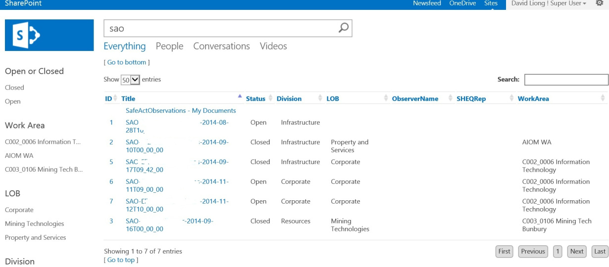

# SharePoint 2013 Search

This is a repository for a client who has an internal department called Safe Act Observation (SAO).
The SAO team has an SharePoint 2010 InfoPath form, which in particular has custom Meta data fields that needs to be searchable in the client's Sharepoint 2013 intranet Search. 

This was achieved with developing the following solutions:
### 1. rcr.sp.framework.wsp
SharePoint Framework: DLL that contains the SharePoint services that are re-usable for many applications; and

### 2. rcr.safeactobservation.wsp
SAO solution package: Custom solution package that contains CSS, list and display templates content web part feature that can added onto a search page.

## References
- Read the 
- For more details about this project visit [my blog site](https://davidliong.wordpress.com/case-studies/enterprise-search/)
